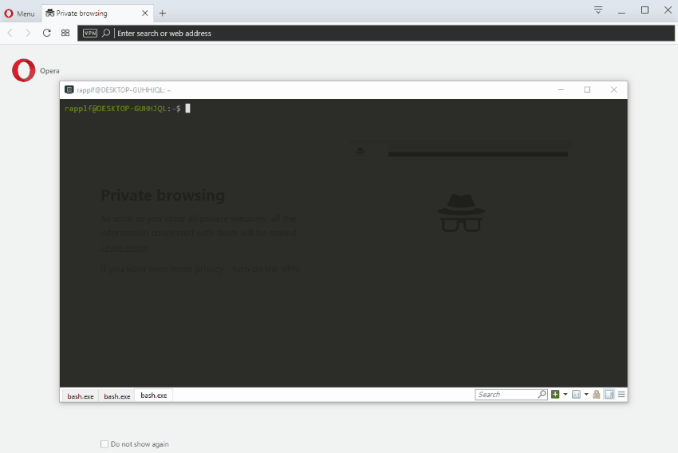

# kras

[](https://github.com/FlorianRappl/kras/actions)
[](https://www.npmjs.com/package/kras)
[](https://www.npmjs.com/package/kras)
[](https://github.com/FlorianRappl/kras/releases)
[](https://github.com/FlorianRappl/kras/issues)

Efficient server proxying and mocking in Node.js. :muscle:


The README is supposed to only give you a basic idea what kras *is*. To *truly find out* about all the possibilities and details the [getting started](docs/getting-started.md) document will give you the right pointers and pieces of information.

## Mission Statement

kras is meant to be a Swiss army knife for server mocking. It is meant for the development of large web applications that consist of a (decoupled) frontend and backend part (e.g., frontend MVC heavy, like a SPA, backend a (micro) service landscape, potentially behind a gateway).

Some cases where the mocking makes sense:

- Instead of running against real backend systems mock data may be returned (allows development also in offline scenarios)
- No need to wait for proposed BE API changes - can all be done already
- The backend cannot be used during development since localhost is not allowed in CORS
- Authentication is done via, e.g., OAuth, where the redirect to localhost is forbidden
- Users reported a problem and submitted an HAR file with real responses - now we want to replay for debugging purposes

There are countless more scenarios where mocking (or intelligent proxying) makes sense. This can go beyond standard REST, e.g., what if the backend has a websocket endpoint for sending events? kras can help us in such scenarios as well - its websocket proxying also allows us to be in the middle and actively send (i.e., broadcast) data to connected clients. This makes it possible to mock these events in question as well.

One sentence to describe the usage of kras is:

> With kras you can truly decouple the development of frontend and backend. It can be an API server, it can be a static or dynamic proxy, it can be everything you need to bend the backend at your will.

Most importantly, kras supports mocking multiple servers (i.e., hostnames) by path-prefixing them. You'll just need to open a single port for all needs.

## Installation

There are two basic ways to use kras. Either globally installed, i.e.,

```bash
npm i kras -g
```

or locally as a development dependency for your project:

```bash
npm i kras -D
```

While the former may be good in general to play around, the latter should be preferred to actually share / configure kras for the particular project.

Running kras can then be done, e.g., via specifying the `kras` command (global usage) or referring to `kras` via the npm scripts in the *package.json*. kras can also be used programmatically, e.g., in a webpack configuration. The library exports several classes and functions that help you establish a mock server for your project in no time.

The following animation shows the first-time experience, where the default configuration is used:



## Configuration

kras uses configuration files and command line options to be properly configured. The configuration files are named `.krasrc` and are looked up in the following order:

1. home directory
2. local directory
3. via the command line specified configuration file

Configuration options are in general flat merged from left to right. Special properties, such as `middlewares`, `injectors`, `map`, or `sources` are merged (one-level deep) and not overwritten.

```sh
npx kras --help
```

If specified the command line options have higher precedence. The following options exist.

```plain
  -c, --config     Sets the configuration file to use, by default .krasrc
                                                                        [string]
  -p, --port       Sets the port of the server, by default 9000         [number]
  -n, --name       Sets the name of the server, by default kras v0.15.2 [string]
  -d, --dir        Sets the base directory of the server, by default
                   /home/rapplf/Code/Piral/kras/mocks                   [string]
  --host           Sets the host binding of the server, by default 0.0.0.0
                                                                        [string]
  --cert           Sets the certificate of the server, by default
                   /home/rapplf/Code/Piral/kras/cert/server.crt         [string]
  --key            Sets the key of the server, by default
                   /home/rapplf/Code/Piral/kras/cert/server.key         [string]
  -l, --log-level  Sets the log level of the application, by default error
                                             [choices: "info", "debug", "error"]
  --skip-api       If set avoids creating the management API endpoint  [boolean]
  --map            Sets the different mappings, e.g.,
                   "--map./=https://httpbin.org"; can be used multiple times
                                                                   [default: {}]
  --version        Show version number                                 [boolean]
  -h, --help       Shows the argument descriptions                     [boolean]
```

The `.krasrc` is a simple JSON format. An example is the following configuration:

```json
{
  "name": "kras",
  "port": 9000,
  "host": "0.0.0.0",
  "directory": ".",
  "uploadLimit": 10,
  "logLevel": "error",
  "ssl": {
    "cert": "cert/server.crt",
    "key": "cert/server.key"
  },
  "api": "/manage",
  "map": {
    "/": "https://httpbin.org",
    "/api": "https://jsonplaceholder.typicode.com",
    "/events": "ws://demos.kaazing.com/echo"
  },
  "injectors": {
    "script": {
      "active": true,
      "directory": "db/"
    },
    "har": {
      "active": true,
      "directory": "db/",
      "delay": false
    },
    "json": {
      "active": true,
      "directory": "db/"
    },
    "proxy": {
      "active": true
    },
    "store": {
      "active": false,
      "directory": "db/"
    }
  }
}
```

Pretty much everything can also be configured from the CLI, e.g.:

```sh
npx kras --map./=https://httpbin.org --map./api=https://jsonplaceholder.typicode.com --map./events=ws://demos.kaazing.com/echo
```

For more information regarding the CLI options use `--help` as written above.

Directory paths are always resolved to an absolute with respect to the location of the containing configuration file. The injector sections are actually dynamic settings that are transported as-is to the respective injector. An injector is just a request handler, which may know how to get an answer to the current request.

The configuration of kras can also be (partially) changed during runtime using the management endpoint. By default this endpoint can be accessed at `https://localhost:9000/manage`. Please note that the HTTPS could be changed to HTTP (if the `ssl` option was disabled), the port could be changed, and the endpoint itself could be changed.

Disabling the management endpoint can be done by setting the `api` option `false`.

## Contributing

We are totally open for contribution and appreciate any feedback, bug reports, or feature requests. More detailed information on contributing incl. a code of conduct are soon to be presented.

Regarding the plans / strategy for kras we also published [a roadmap document](docs/roadmap.md).

## FAQ

*What does kras mean?*

kras is the abbreviation for "kein reiner API server" (German), indicating that kras is actually not (only or exclusively) an API server, but just serving (or proxying) content from an arbitrary server (which could be an API server, of course). Literally, it means "not a pure API server" referring to the number of possibilities for serving *any* HTTP-based content plus websockets.

*Is kras useful for unit and / or integration tests?*

I think so, even though real end-to-end tests should be performed against the real backend. Nevertheless, using kras we can rely on fixed contracts for our backend. Additionally, it allows us to run these tests even when no Internet connection is available. For unit tests the big advantage is that the mocking part is not / has not to be configured within our own code base, but in an external one. This is a little bit more robust against refactoring.

*Can the order of the injectors be changed?*

Yes, totally. The order is given by the order in the JSON defining the different injectors, e.g., swapping two entries in the JSON will result in changing the order of the injectors respectively.

*Why is the server HTTPS by default?*

Normally, API servers in most projects are HTTPS only. Thus the configuration part in standard code may be reduced to a hostname, e.g., 

```js
function buildApiServer(host) {
  return `https://${host}/api`;
}
```

where `host` can be the actual host in one particular environment (e.g., production or stage), but could also be replaced by, e.g., `localhost:9000/foo`. Long story short, it seemed like a sound choice.

*The default certificate is not trusted - what can I do about it?*

Well, you could add the certificate to your trusted roots and therefore get rid of the message. However, if you (understandably) don't want to trust third-party generated certificates you can also [generate your own certificate](docs/generate-certificate.md) and use that one instead. Finally, you could either switch off HTTPS (disable SSL), or use a special browser instance with SSL checking disabled (for Chrome starting with the command line flag `--ignore-certificate-errors` does the trick; don't use this for browsing the public web).

*How can I use kras with webpack?*

There are several ways on how to use kras with webpack. The two most common ways are [documented in detail here](docs/webpack.md). In general, the idea is to run kras side by side to the webpack dev server. This can be archieved by modifying the used *webpack.config.js* or by concurrently running two processes. Of course, programmatically, it can be also achieved to run the webpack dev server and kras on the same port, however, the gain is potentially not worth the effort (at least for most users).

*Isn't this the same as http-proxy-middleware?*

[http-proxy-middleware](https://github.com/chimurai/http-proxy-middleware) is a great package. Maybe if I would have known about it earlier kras (or any earlier form of it) would not exit. But kras is different. While http-proxy-middleware gives you a tool for being used in an Express application, kras gives you a full server including a finished client for simple modifications and interactions during runtime. Furthermore, kras can be used as a library, which creates the full server for you. Finally, kras tries to be easy to extend with its injector model, which is completely independent of Express or any other HTTP framework. The way I see it http-proxy-middleware would be the lib of choice for bringing proxy-ing capabilities to an Express application, while kras is the tool of choice for general mocking or proxy-ing of requests via a localhost service.

*Can I write my own injector?*

Yes. Injectors are powerful stuff and can be written in your own code base / project or in their own repository. They could be globally registered or published via NPM. More details [can be found here](docs/injectors.md).

*I don't like the web client - what can I do?*

The bundled client is only the default client. If you prefer you can interact with kras via `curl` or postman or any other possibility to run raw API requests. If this is too tedious you could also write a custom client. If the client is registered as an NPM package kras can also (via the configuration) serve that client from the management endpoint. Details are aggregated [in the client documentation](docs/client.md).

*I need to protect the management API but how?*

The management API can be protected with the `auth` option. More information can be read [in the authentication documentation](docs/auth.md).

## License

kras is released using the MIT license. For more information see the [LICENSE file](LICENSE).
