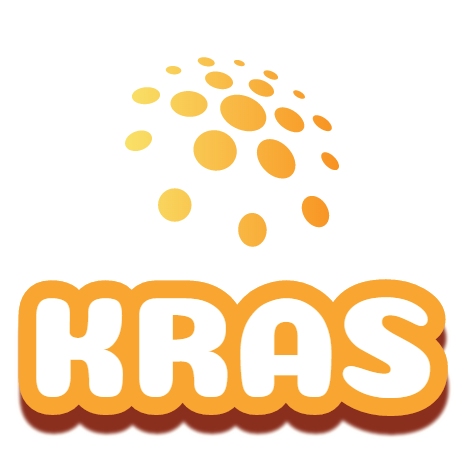

# kras

Efficient server proxying and mocking in Node.js. :muscle:

## FAQ

*What does kras mean?*

kras is the abbreviation for "kein reiner API server" (German), indicating that kras is actually not (only or exclusively) an API server, but just serving (or proxying) content from an arbitrary server (which could be an API server, of course). Literally, it means "not a pure API server" referring to the number of possibilities for serving *any* HTTP-based content plus websockets.

*Is kras useful for unit and / or integration tests?*

I think so, even though real end-to-end tests should be performed against the real backend. Nevertheless, using kras we can rely on fixed contracts for our backend. Additionally, it allows us to run these tests even when no Internet connection is available. For unit tests the big advantage is that the mocking part is not / has not to be configured within our own code base, but in an external one. This is a little bit more robust against refactorings.

## License

kras is released using the MIT license. For more information see the [LICENSE file](LICENSE).
