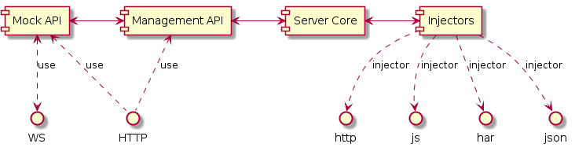

# Getting Started

## Introduction

The mock server provides a simple architecture to return standard or customized responses to defined API calls. This is by no means restricted to a REST based API, even though this is obviously the major target.

One example for the domain specific parts is the target system. In order to mock complex systems correctly we would need *different* mock servers (as multiple services can / will be used in the real world, e.g., `serviceA`, `serviceB`, ...). This would be very inconvenient. Instead, the mock server contains *target endpoints* starting with an arbitrary string to do the mapping. Incoming requests are normalized to strip out the target and place it in it's own property. Therefore, e.g., requests to `/serviceA/foo` would be consumed by the `/serviceA` target and interpreted as a request to `/foo`.

The normalization also works for all requests. Instead of forwarding the standard Node.js request object a much smaller version is created. This DTO is essentially reduced to all the fields that may be relevant for properly mocking the request. Also things like a `_` query parameter (e.g., coming from jQuery) are removed.

Responses are constructed in a similar manner. A lightweight DTO has to be constructed, which is then transformed to give a Node.js response. This is all done by the mock server core.

With this information we can have a short look at the architecture of the server.

## Architecture

The diagram below shows us how the different components interact with each other.

The most important part is the injector. Currently, five injectors have been integrated:

- HAR injector
- Script (JS) injector
- JSON injector
- Proxy/forward injector
- Store injector

The first three all take files from a given directory. The directory can be set from the command line or via the configuration file. By default it is resolved to be the "db" directory in the current working directory. The proxy injector one is directly communicating to the target system. The server paths may be set via a configuration file.

The store injector is storing the request data to be used for providing some useful mocking data later on. That way the requests can be simply inferred from a session without mock data. In the next step the mock data is written to the JSON files, thus being consumed again by, e.g., the JSON injector.

More injectors (such as specialization of the former, e.g., Swagger injector, GraphQL injector, ...) can be created and will be automatically picked up if a node module with a `[name]-injector` naming scheme is found.

## Injectors

The injectors are so queried in the order given in the configuration file (by default JS, HAR, JSON, Proxy, Store). The first one that has a successful match ends this pipe. Normally, the proxy will always get a response so it may make sense to deactivate it if any other injector should be used afterwards. The store injector will definitely end the pipe.

Besides the command line some options and configuration files some options can be changed at runtime. This is done from the manage endpoints of the mock server. By default, the management endpoint is available under `/manage`. It can be configured as well. Besides activating or deactivating injectors we'll also find information about previously handled requests and messages. We can also broadcast new events via the web socket channel.

The web socket channel is (if activated) also proxied to the real API. However, as the mock server is sitting in between the real API and the client it is possible to also use it. This is done to allow simulating rare events such as a reboot of a SHC. Besides using the web interface to emit a message we can also send a message to the `~/broadcast` management endpoint (e.g., `/manage/broadcast`) using a POST message with the body representing the web socket message.

Now that we know roughly how it works it is time to look at some of the ordinary injectors in more detail. We already know that the source files for all these injectors are sitting in a configured directory. There is also a watcher to refresh the injector's content when a watched file changes. Each injector only uses files following a specific pattern, e.g., *.json, as file name. Let's start with details for the JSON injector.

### JSON Injector

The JSON injector is really simple. It assumes that each request/response pattern is an object with two properties: "request" and "response" respectively. JSON files may either contain an array of such objects or a single such object. There is one more interesting possibility here. While the objects stored in the request and response properties are usually one to one manifestations of the DTOs mentioned earlier, the response property may also contain am array of such DTOs. If an array is provided the selected response is randomly determined. If desired unknown requests are also stored in a format that is readable by the JSON injector. These requests will be added to a file called unknown-requests.json in the configured directory.

More detailed information can be found in the [JSON injector documentation](json-injector.md).

### HAR Injector

The HAR injector is quite similar to the JSON injector. It also deals with static content in form of JSON files. Here, however, the JSON schema is set to the standardized HAR (HTTP Archive) schema in version 1.3. The advantage of HAR is that all evergreen browsers know how to export it. That way it is very easy to consume a previous user flow, derive a unit test followed by a conclusion, and fix the bug. The barrier to reproduce the bug should be minimal (minus local database content). This injector does not have a randomized answer. It's only ability is to delay the responses to the original time. Otherwise, the response is generated nearly instantaneous.

More detailed information can be found in the [HAR injector documentation](har-injector.md).

### Script Injector

Finally, the script injector. This is certainly the most powerful and flexible injector. It is, however, also the most complicated one. Theoretically, this injector could be used to build a fully dynamic model of the BE to really mock everything. It could therefore be also used to replicate more complicated user flows or represent an immutable backend for demo purposes.

More detailed information can be found in the [script injector documentation](script-injector.md).

### Proxy Injector

Let's now understand the proxy injector. The proxy injector essentially just forwards the existing request to a given endpoint. The exact endpoint is determined by the current request's target and the normalized path. Whatever the response is (it could be a 200, 404, 500, or any other status code) will be forwarded back to the client. Therefore the proxy injector is set as the last injector in the pipeline.

There is no handling of CORS in this injector. CORS is handled already from the server directly (i.e., the server is great to avoid any security problems related to CORS or other mechanisms). However, what is handled by this injector is the web socket connection to the other side. This cannot be separated from the HTTP part.

The web socket handler will create a new connection per connected user. Thus, if we share the mock server between different users then every user will get its own connection to some backend via the proxy injector. However, as an important distinction it is worth noting that a broadcast triggered from the core will reach all connected clients. So we have `n` forwarded connections for `n` users, with a shared part in the middle.

More detailed information can be found in the [proxy injector documentation](proxy-injector.md).

### Custom Injectors

It is also possible to write custom injectors - or get new injectors from NPM. Details on writing and publishing injectors can be found in [the injector documentation](injectors.md).
